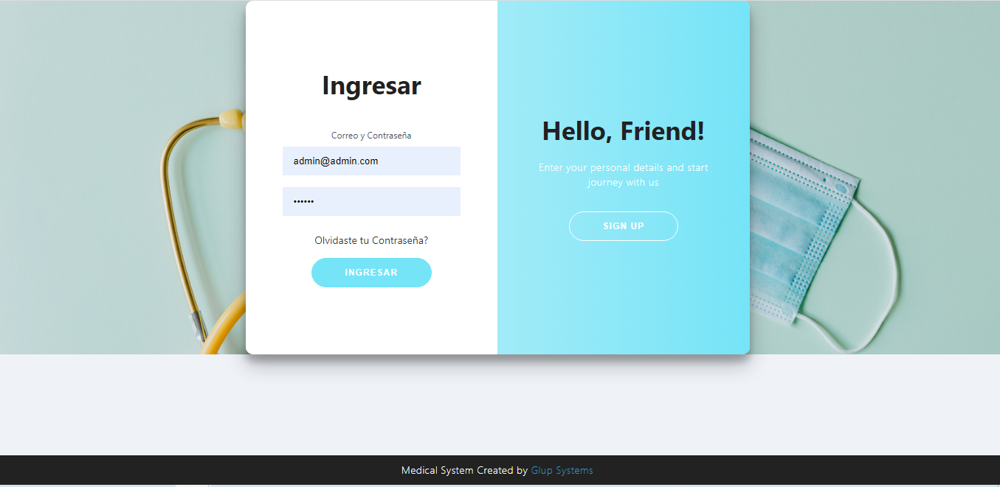
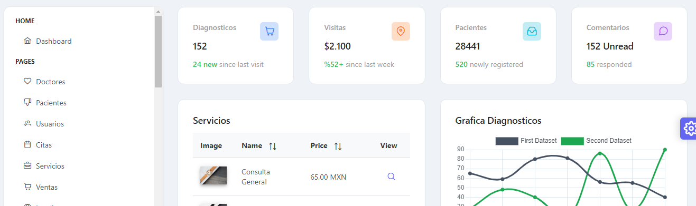
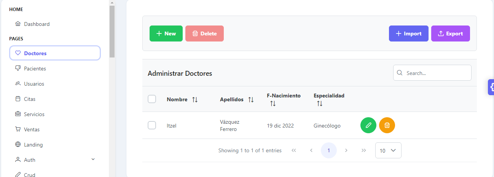
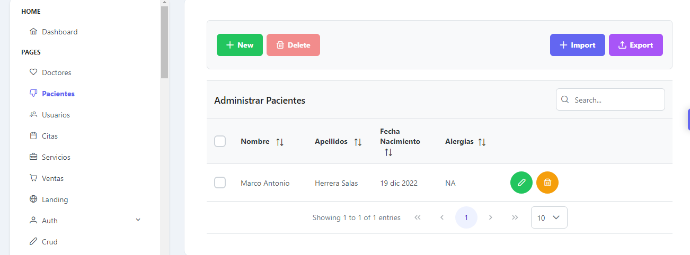
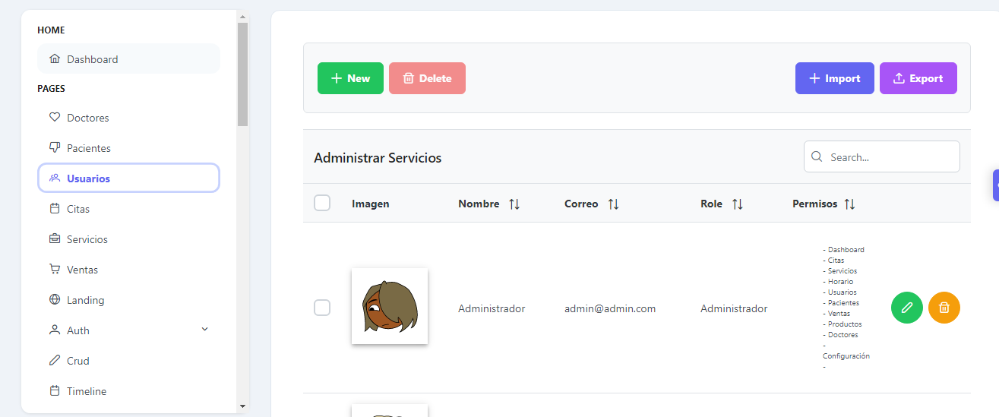
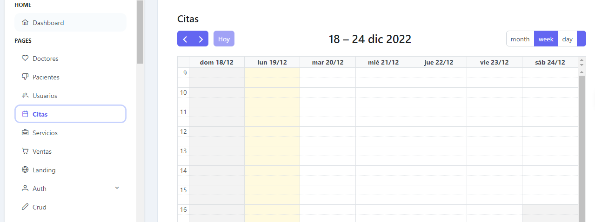
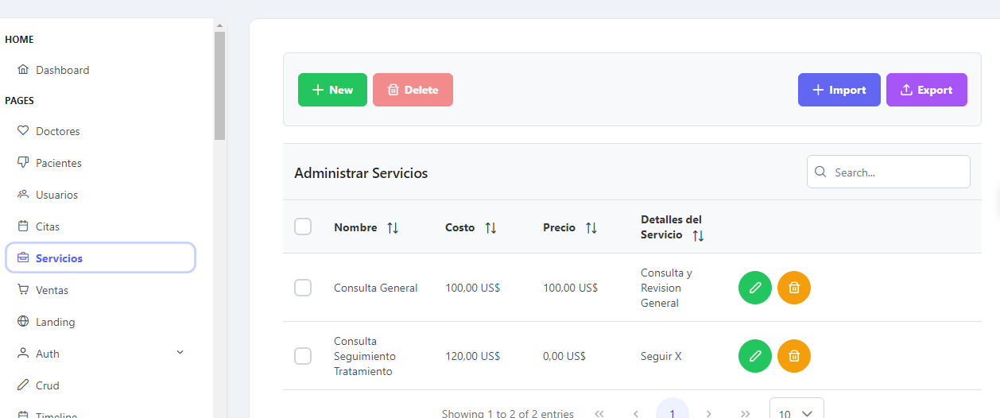
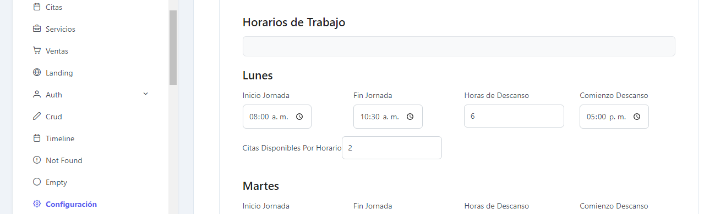

<!-- ## What's included in MaterialPro Angular 12 Lite [versions 7,8,9, and 10,11] -->

<!-- Heading of Template -->
<h1>
  Doctor Office
</h1>

<!-- Main image of Template -->
  

Sistema DoctorsOffice desarrollado en Angular ~14.0.3 con el fin de controlar un consultorio médico 

El sistema se encuentra en desarrollo las integraciones se harán poco a poco además que el software es privado. 

El backend es desarrollado en node Js y con base de datos en Mongo DB el backend se subira a otro repositorio en la siguiente liga DoctorsOffice Backend: <a href="https://github.com/MarcoAntonioHerreraSalas/backend-doctorsoffice.git">https://github.com/MarcoAntonioHerreraSalas/backend-doctorsoffice.git </a>

Asi mismo el sistema trabaja con una version de Sakai Admin para facilitar el trabajo de admin panel y  se utilizo la version gratuita.

## Que contiene la versión v1 Doctor's Office

<ul>
<li>Login y Token de seguridad</li>
<li>Sakai Admin</li>
<li>Angular Guard para Inicio de Sesión</li>
<li>Modulo de Servicios</li>
<li>Modulo de Agendar Citas</li>
<li>CRUD Usuarios</li>
<li>CRUD Pacientes</li>
<li>CRUD Doctores</li>
<li>Modulo Diagnostico Doctores a Pacientes</li>
<li>Módulo Configuraciones de Negocio</li>
</ul>

## Para descargar el sistema ejecutar en CMD 

`Git clone https://github.com/MarcoAntonioHerreraSalas/doctorsoffice.git `

Seguido de la descarga del repositorio ejecutar la siguiente línea para las dependencias ( Recuerda tener
la versión de Angular ~14.0.3 ya instalada

`npm install`

## Development server

Run `ng serve` for a dev server. Navigate to `http://localhost:4200/`. The app will automatically reload if you change any of the source files.

<!-- Versions of Template -->
<h2>Versions</h2>
<table>
  <thead>
    <tr>
      <th>v1</th>
      <th>v1.2</th>
      <th>v1.3</th>
      <th>v1.4</th>
      <th>v1.5</th>
      <th>v1.6</th>
    </tr>
  </thead>
  <tbody>
    <tr>
      <td>
          
      </td>
      <td>
          
      </td>
      <td>
          
      </td>
      <td>
          
      </td>
      <td>
          
      </td>
      <td>
          
      </td>
      <td>
          
      </td>
    </tr>
  </tbody>
</table>

<!-- <table>
  <thead>
    <tr>
      <th>v2</th>
    </tr>
  </thead>
  <tbody>
    <tr>
      <td>
          
      </td>
    </tr>
  </tbody>
</table> -->

## Versión completa pronto disponible

<h2>Social Media</h2>

Facebook: <a href="https://ms-my.facebook.com/GlupSystems/">https://ms-my.facebook.com/GlupSystems/</a>

Pagina Web: <a href="http://glupsystems.mx/">http://glupsystems.mx/</a>
